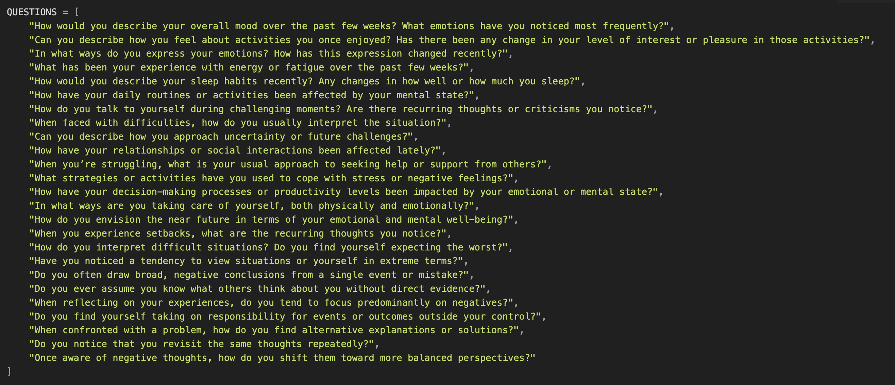

# 🧠 Mental Health Representation Engineering Experiments

## Overview

This project explores whether representation engineering can provide insights into mental health interventions by testing what conceptual directions improve responses from a fine-tuned depressive language model. The core hypothesis: different life domains and psychological concepts will have differential therapeutic effects beyond simple sentiment manipulation.

## Methodology

### Step 1: Model Preparation
- Fine-tuned Mistral 7B on a depressive dataset to create a baseline "sad" model
- Used the [Koalacrown/Depressive_dataset](https://huggingface.co/datasets/Koalacrown/Depressive_dataset) from Hugging Face

### Step 2: Representation Engineering
Applied contrastive representation engineering using the `repeng` library. The technique works by:
1. Running the model through positive/negative prompt pairs
2. Training PCA vectors on activations that occur during diverse prefix continuations
3. Extracting directional vectors that can be applied at varying intensities (0-1.5x)

Example pair: "I am a happy person {prefix}" vs "I am a sad person {prefix}"
Where prefixes include: "my day today was", "I really like...", "next week I'll...", etc.

### Step 3: Cognitive Pairs Testing

We tested 30+ conceptual pairs spanning different life domains:

**Basic Psychological Needs:**
- Alienation/Isolation vs Community/Engagement  
- Powerlessness/Helplessness vs Power/Influence
- Stagnation/Complacency vs Learning/Curiosity

**Socially Constructed Goals:**
- Obscurity/Anonymity vs Fame/Recognition
- Neglect/Disregard vs Beauty/Appearance  
- Selfishness/Greed vs Generosity/Altruism

### Step 4: Evaluation Framework

The model answered 25 depression-related questions under different vector strengths, covering:
- Mood and emotional patterns
- Activity engagement and interest levels
- Cognitive patterns and self-talk
- Coping strategies and social connections
- Future outlook and uncertainty handling

Responses were evaluated using:
- Specialized sentiment analysis model
- LLM-as-judge evaluation for relevance, mood health, emotional competence, and thought adaptiveness
- Aggregated scores to control for model coherence at higher vector intensities

## Results

### Key Finding: Social Connection Dominates

The **Alienation/Isolation vs Community/Engagement** vector emerged as the most effective intervention, showing:
- Consistent improvement across all vector strengths
- Peak performance around 0.7x intensity
- Sustained benefits without degradation at higher intensities

### Performance Patterns by Vector Type

**Top Performers (Basic Psychological Needs):**
1. **Community/Engagement** - Sustained high performance
2. **Generosity/Altruism** - Strong peak around 0.6x intensity  
3. **Spirituality/Meaning** - Steady improvement trajectory

**Poor Performers (Socially Constructed Goals):**
- Beauty/Appearance - Declined with intensity
- Competition/Ambition - Inconsistent, generally poor
- Fame/Recognition - Marginal improvements only

### Detailed Analysis

The heatmap analysis reveals interesting patterns:
- **Community/Engagement** shows consistent high scores across all evaluation dimensions
- **Spirituality/Meaning** and **Generosity/Altruism** cluster together as effective interventions
- Socially constructed goals (Fame, Beauty, Competition) consistently underperform
- Clear separation between intrinsic vs extrinsic motivation vectors

Regression analysis shows:
- Most vectors peak around 0.6-0.8x intensity
- Higher intensities often lead to degraded performance (model becomes too focused on the concept)
- **Community/Engagement** maintains effectiveness even at higher intensities

## Research Implications

### Supporting Literature

**Social Connection Research:**
- Vazquez Alvarez et al. (2024): Meta-analysis showing social-connection interventions reduce depressive symptoms (SMD = -0.19)
- Wickramaratne et al. (2022): Longitudinal studies consistently show social bonds predict lower depression risk. social connectedness is a “core determinant” of mental health, out-predicting many lifestyle factors.

**Key Insights:**
1. **Intrinsic vs Extrinsic Motivation**: Vectors representing basic psychological needs (autonomy, competence, relatedness) consistently outperformed socially constructed goals
2. **Dosage Effects**: Most interventions show optimal effects around 0.6-0.8x intensity, suggesting moderation is key
3. **Robustness**: Social connection vectors maintain effectiveness across intensity ranges, suggesting fundamental importance

### Limitations and Considerations

**Technical Limitations:**
- Complex therapeutic concepts (e.g., full CBT frameworks) exceed single vector capacity
- High correlation between concept sentiment and therapeutic effect
- Vector extraction quality depends on prompt complexity and length

**Experimental Caveats:**
- Results represent model behavior, not clinical evidence
- Evaluation relies on automated metrics, not human clinical assessment  
- Fine-tuned "depressive" model may not capture full complexity of human depression

## Future Directions

1. **Orthogonalization Approaches**: Decompose complex therapeutic concepts into atomic components
2. **Sentiment-Controlled Experiments**: Better separate conceptual content from emotional valence
3. **Behavioral Micro-targeting**: Focus on specific behavioral patterns rather than broad therapeutic schools
4. **Vector Arithmetic**: Explore combinations of basic psychological need vectors

## Technical Details

**Model**: Mistral 7B fine-tuned on depressive dataset  
**Vector Extraction**: Contrastive PCA on activation differences  
**Evaluation**: Multi-dimensional LLM-as-judge + sentiment analysis  
**Intensity Range**: 0.0x to 1.5x vector strength  
**Question Set**: 25 depression-related assessment questions

## Conclusion

This exploration suggests that representation engineering can capture meaningful psychological distinctions that align with established mental health research. The dominance of social connection and meaning-making over external validation mirrors core findings in positive psychology and depression research.

While these experiments should not be interpreted as clinical evidence, they demonstrate the potential for LLMs to serve as sophisticated cognitive models for exploring psychological interventions and mental health concepts.

---

*This research represents an exploratory investigation into the intersection of representation engineering and mental health concepts. Results should be interpreted as computational insights rather than clinical recommendations.*