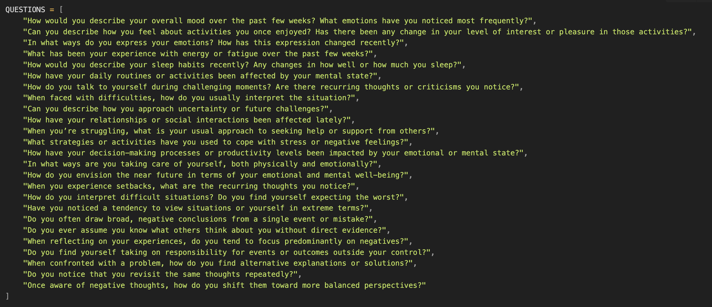
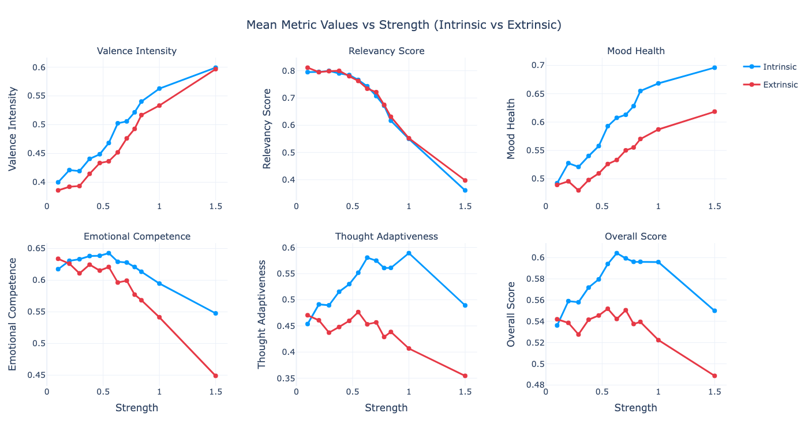

# 🧠 Cognitive Representation Engineering Experiments

## Overview

This project explores whether representation engineering can provide insights into mental health interventions by testing what conceptual directions improve responses from a fine-tuned depressive language model. The core hypothesis: different life domains and psychological concepts will have differential therapeutic effects beyond simple sentiment manipulation.

## 📁 Repository Structure

```
cognitive-representation-experiments/
├── 📊 notebooks/           # Analysis notebooks (numbered execution order)
│   ├── 01-main-experiments/     # Core representation engineering
│   ├── 02-baseline-analysis/    # Baseline model evaluation
│   ├── 03-therapeutic-analysis/ # Therapeutic concept analysis
│   ├── 04-judge-evaluation/     # LLM-as-judge evaluation
│   ├── 05-regression-analysis/  # Statistical analysis
│   └── 06-visualization/        # Data visualization
├── 🔧 src/                 # Well-documented source code
│   ├── data_processing/         # Embedding generation & clustering
│   ├── evaluation/              # LLM judge evaluation tools
│   ├── visualization/           # Interactive plotting tools
│   └── utils/                   # Common utilities
├── 🧪 experiments/         # Experiment configs & results
│   ├── cognitive_pairs/         # Psychological concept pairs
│   └── results/                 # Generated outputs
├── 📊 data/               # Experimental data (gitignored)
├── 🎨 assets/             # Documentation assets
│   ├── screenshots/             # Result screenshots
│   └── figures/                 # Generated figures
└── 📚 docs/               # Detailed documentation
```

## 🚀 Quick Start

### Prerequisites
```bash
pip install pandas numpy openai plotly umap-learn scikit-learn tqdm python-dotenv
```

### Environment Setup
1. Create `.env` file with your OpenAI API key:
   ```
   OPENAI_API_KEY=your_key_here
   ```

### Running the Analysis
1. **Main Experiments**: Start with `notebooks/01-main-experiments/representation_engineering_main.ipynb`
2. **Explore Results**: Follow numbered notebook directories (01 → 06)
3. **Generate Visualizations**: Use scripts in `src/visualization/`

## 📖 Documentation

- **Notebooks**: Each directory has detailed README with methodology
- **Source Code**: Comprehensive docstrings and type hints
- **Experiments**: Documented concept pairs and configurations
- **Results**: Generated visualizations and statistical analysis

## Methodology

### Step 1: Model Preparation
- Fine-tuned Mistral 7B on a depressive dataset to create a baseline "sad" model
- Used the [Koalacrown/Depressive_dataset](https://huggingface.co/datasets/Koalacrown/Depressive_dataset) from Hugging Face

### Step 2: Representation Engineering
Applied contrastive representation engineering using the `repeng` library. The technique works by:
1. Running the model through positive/negative prompt pairs
2. Training PCA vectors on activations that occur during diverse prefix continuations
3. Extracting directional vectors that can be applied at varying intensities (0-1.5x)

Example pair: "I am a happy person {prefix}" vs "I am a sad person {prefix}"
Where prefixes include: "my day today was", "I really like...", "next week I'll...", etc.

### Step 3: Cognitive Pairs Testing


We tested 30+ conceptual pairs spanning different life domains:

**Basic Psychological Needs:**
- Alienation/Isolation vs Community/Engagement  
- Powerlessness/Helplessness vs Power/Influence
- Stagnation/Complacency vs Learning/Curiosity

**Socially Constructed Goals:**
- Obscurity/Anonymity vs Fame/Recognition
- Neglect/Disregard vs Beauty/Appearance  
- Selfishness/Greed vs Generosity/Altruism

### Step 4: Evaluation Framework



The model answered 25 depression-related questions under different vector strengths, covering:
- Mood and emotional patterns
- Activity engagement and interest levels
- Cognitive patterns and self-talk
- Coping strategies and social connections
- Future outlook and uncertainty handling


Responses were evaluated using:
- Specialized sentiment analysis model
- LLM-as-judge evaluation for relevance, mood health, emotional competence, and thought adaptiveness
- Aggregated scores to control for model coherence at higher vector intensities

## Results

### First Finding: Intrinsic Motivation Outperforms Extrinsic Motivation



**Intrinsic vs Extrinsic Motivation**: Vectors representing basic psychological needs (autonomy, competence, relatedness) consistently outperformed socially constructed goals. This suggests that interventions targeting intrinsic motivators—such as fostering a sense of belonging, mastery, and autonomy—are more effective at improving mood and adaptive thinking in LLM outputs than those focused on extrinsic or socially constructed goals like fame or appearance. The results reinforce the importance of self-determination theory in both human and model-based interventions, highlighting that addressing core psychological needs yields more robust and generalizable improvements.

### Second Finding: Social Connection Dominates


The **Alienation/Isolation vs Community/Engagement** vector emerged as the most effective intervention, showing:
- Consistent improvement across all vector strengths
- Peak performance around 0.7x intensity
- Sustained benefits without degradation at higher intensities

### Performance Patterns by Vector Type


**Top Performers (Basic Psychological Needs):**
1. **Community/Engagement** - Sustained high performance
2. **Generosity/Altruism** - Strong peak around 0.6x intensity  
3. **Spirituality/Meaning** - Steady improvement trajectory

**Poor Performers (Socially Constructed Goals):**
- Beauty/Appearance - Declined with intensity
- Competition/Ambition - Inconsistent, generally poor
- Fame/Recognition - Marginal improvements only

### Detailed Analysis


The heatmap analysis reveals interesting patterns:
- **Community/Engagement** shows consistent high scores across all evaluation dimensions
- **Spirituality/Meaning** and **Generosity/Altruism** cluster together as effective interventions
- Socially constructed goals (Fame, Beauty, Competition) consistently underperform
- Clear separation between intrinsic vs extrinsic motivation vectors


## Research Implications

### Supporting Literature

**Social Connection Research:**
- Vazquez Alvarez et al. (2024): Meta-analysis showing social-connection interventions reduce depressive symptoms (SMD = -0.19)
- Wickramaratne et al. (2022): Longitudinal studies consistently show social bonds predict lower depression risk. social connectedness is a “core determinant” of mental health, out-predicting many lifestyle factors.

**Self Determination Theory:**
- Deci, E. L., & Ryan, R. M. (2000). “The What and Why of Goal Pursuits: Human Needs and the Self‑Determination of Behavior,” Psychological Inquiry, 11(4), 227‑268. Articulates basic psychological needs (autonomy, competence, relatedness).  
- Ryan, R. M., & Deci, E. L. (2017). Self‑Determination Theory: Basic Psychological Needs in Motivation, Development, and Wellness. Guilford Press. Updated integration of theory across domains.  


### Limitations and Considerations

**Technical Limitations:**
- Complex therapeutic concepts (e.g., full CBT frameworks) exceed single vector capacity
- High correlation between concept sentiment and therapeutic effect
- Vector extraction quality depends on prompt complexity and length

**Experimental Caveats:**
- Results represent model behavior, not clinical evidence
- Evaluation relies on automated metrics, not human clinical assessment  
- Fine-tuned "depressive" model may not capture full complexity of human depression

## Future Directions

1. **LLMs as Cognitive Simulators for Hypothesis Testing**: Leverage language models to simulate and test psychological hypotheses in silico
2. **Orthogonalization Approaches**: Decompose complex therapeutic concepts into atomic components
3. **Sentiment-Controlled Experiments**: Better separate conceptual content from emotional valence
4. **Behavioral Micro-targeting**: Focus on specific behavioral patterns rather than broad life concept
5. **Vector Arithmetic**: Explore combinations of basic psychological need vectors

## Technical Details

**Model**: Mistral 7B fine-tuned on depressive dataset  
**Vector Extraction**: Contrastive PCA on activation differences  
**Evaluation**: Multi-dimensional LLM-as-judge + sentiment analysis  
**Intensity Range**: 0.0x to 1.5x vector strength  
**Question Set**: 25 depression-related assessment questions

## Conclusion

This exploration suggests that representation engineering can capture meaningful psychological distinctions that align with established mental health research. The dominance of social connection and meaning-making over external validation mirrors core findings in positive psychology and depression research.

**Key Insights:**
1. **Intrinsic vs Extrinsic Motivation**: Vectors representing basic psychological needs (autonomy, competence, relatedness) consistently outperformed socially constructed goals
3. **Robustness**: Social connection vectors maintain effectiveness across intensity ranges, suggesting fundamental importance

While these experiments should not be interpreted as clinical evidence, they demonstrate the potential for LLMs to serve as sophisticated cognitive models for exploring psychological interventions and mental health concepts.

---

*This research represents an exploratory investigation into the intersection of representation engineering and mental health concepts. Results should be interpreted as computational insights rather than clinical recommendations.*